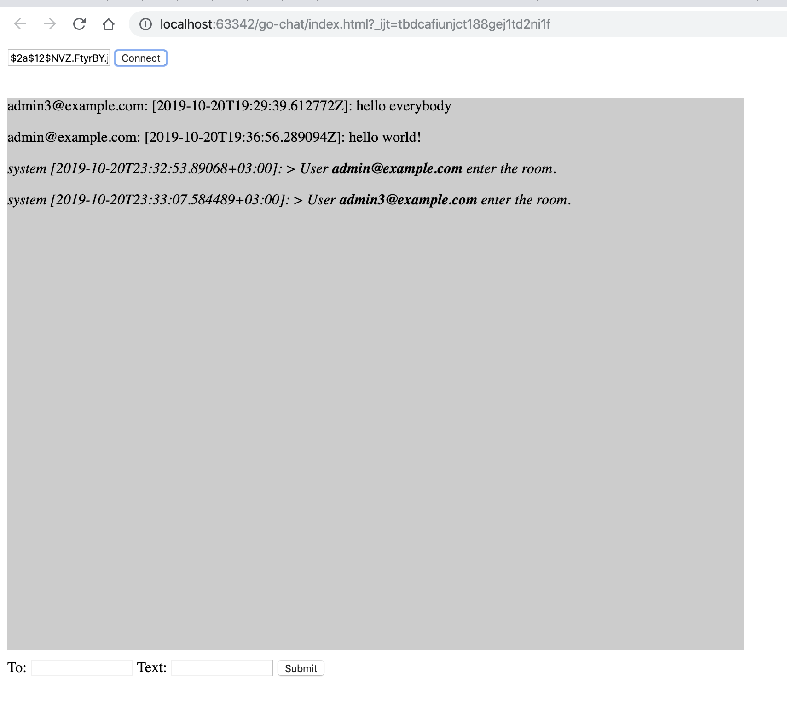

### Возможности программы

- Позволяет регистрироваться и авторизоваться по api
- По полученному токену дает возможность подключиться через websocket
- Чат реализует историю публичных сообщений, личные сообщения (через указание получателя в отдельном поле), системные сообщения (например, о входе нового пользователя) 

### Пример интерфейса

